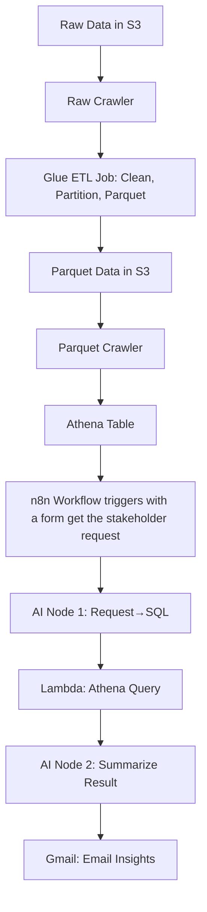

# AI-Enhanced-ETL-pipeline-with-AWS-n8n

# Athena Insights Automation Project

Automate stakeholder data requests and business insights using AWS ETL (Glue, Crawlers, Athena, S3, Parquet) with n8n, Lambda, and AI-based query/insight generation.

---

## Table of Contents

- [Architecture Overview](#architecture-overview)
- [Project Folder Structure](#project-folder-structure)
- [ETL Pipeline (AWS Glue, Crawlers, Parquet)](#etl-pipeline-aws-glue-crawlers-parquet)
    - [Step 1: Raw Data Crawler](#step-1-raw-data-crawler)
    - [Step 2: Glue ETL Job](#step-2-glue-etl-job)
    - [Step 3: Parquet Data Crawler](#step-3-parquet-data-crawler)
- [Athena Setup](#athena-setup)
- [Lambda Function for Athena Query](#lambda-function-for-athena-query)
- [n8n Workflow Automation](#n8n-workflow-automation)
    - [AI Node 1: Stakeholder Request → SQL](#ai-node-1-stakeholder-request--sql)
    - [Lambda Node: Execute Athena Query](#lambda-node-execute-athena-query)
    - [AI Node 2: Summarize Athena Result](#ai-node-2-summarize-athena-result)
    - [Gmail Node: Email Insights](#gmail-node-email-insights)
- [Security & IAM Guide](#security--iam-guide)
- [References](#references)

---

## Architecture Overview



---

## Project Folder Structure

```
@athena_insights_auto/
├── etl/                                    # ETL Pipeline Components
│   ├── crawler_raw/                       # Raw data crawler configuration
│   │   └── README.md                      # Raw crawler setup guide
│   ├── glue_job/                          # Glue ETL job scripts
│   │   ├── job_script.py                  # Main ETL transformation script
│   │   └── README.md                      # Job configuration guide
│   └── crawler_parquet/                   # Parquet data crawler configuration
│       └── README.md                      # Parquet crawler setup guide
│
├── lambda/                                 # AWS Lambda Functions
│   ├── athena-query-runner/               # Athena query execution function
│   │   ├── lambda_function.py             # Main Lambda handler
│   │   └── requirements.txt               # Python dependencies
│   └── docs/                              # Lambda documentation
│       └── lambda_setup.md                # Lambda deployment guide
│
├── n8n_workflow/                          # n8n Workflow Automation
│   ├── workflow.json                      # Complete n8n workflow definition
│   └── docs/                              # n8n documentation
│       └── n8n_steps.md                   # Workflow setup guide
│
├── schema/                                # Data Schema Documentation
│   └── dataset_schema.md                  # Database schema for AI SQL generation
│
├── PROJECT_STRUCTURE.md                   # Detailed project structure guide
└── README.md                              # Main project documentation
```

---

## ETL Pipeline (AWS Glue, Crawlers, Parquet)

### Step 1: Raw Data Crawler

- Configure a Glue Crawler (`etl/crawler_raw/`) to scan your raw S3 data in the `raw-zone/` folder.
- Creates a table in the Glue Data Catalog for your raw retail sales dataset.

### Step 2: Glue ETL Job (Cleaning, Partitioning, Parquet)

- Write a Glue job (`etl/glue_job/job_script.py`) to:
    - Read raw transaction data from S3 `raw-zone/` folder
    - Clean and transform data (remove duplicates, handle null values)
    - Extract date components for partitioning (year, month, day)
    - Convert to Parquet format with Snappy compression
    - Write cleaned, partitioned Parquet files to `processed-zone/` folder

### Step 3: Parquet Data Crawler

- Configure a second Glue Crawler (`etl/crawler_parquet/`) to scan the Parquet data in `processed-zone/`.
- Updates Glue Data Catalog with the Parquet table (optimized for Athena queries).

---

## Athena Setup

- Use the Parquet table from the Glue Data Catalog in Athena.
- Validate column types and partitions.
- See `schema/dataset_schema.md` for schema details (used for AI SQL generation).

---

## Lambda Function for Athena Query

- Deploy `lambda/athena-query-runner/lambda_function.py` on AWS Lambda.
- Lambda function has an execution role with Athena, S3, and Glue access permissions.
- n8n user has permission to invoke the Lambda function.
- Lambda receives SQL query, database, and output location, runs Athena query, and returns result metadata.

See setup steps in `lambda/docs/lambda_setup.md`.

---

## n8n Workflow Automation

- Import `n8n_workflow/workflow.json` into n8n.

### AI Node 1: Stakeholder Request → SQL

- Receives a natural language request (e.g., "Show me sales by gender for this month").
- Converts it to a valid SQL query for Athena, using the retail sales schema context.
- Uses the transaction data schema: transaction_id, date, customer_id, gender, age, product_category, quantity, price_per_unit, total_amount.

### Lambda Node: Execute Athena Query

- Sends the generated SQL to Lambda (`athena-query-runner`).
- Lambda returns Athena query result.

### AI Node 2: Summarize Athena Result

- Takes the Athena result and generates a business-friendly summary or insight.

### Gmail Node: Email Insights

- Sends the summarized insight to the stakeholder automatically.

See full workflow in `n8n_workflow/docs/n8n_steps.md`.

---

## Security & IAM Guide

- Glue, Lambda, Athena, and n8n IAM roles/policies are documented in `lambda/docs/lambda_setup.md`.
- Principle of least privilege is recommended.

---

## References

- [AWS Glue Docs](https://docs.aws.amazon.com/glue/latest/dg/what-is-glue.html)
- [AWS Athena Docs](https://docs.aws.amazon.com/athena/latest/ug/what-is.html)
- [n8n Docs](https://docs.n8n.io/)
- [AWS Lambda Docs](https://docs.aws.amazon.com/lambda/latest/dg/welcome.html)

---

## How to Get Started

1. Complete ETL pipeline (crawlers, Glue job, Parquet conversion).
2. Set up Athena table and validate schema.
3. Deploy Lambda function and configure IAM.
4. Import and configure n8n workflow.
5. Test end-to-end by sending a stakeholder request.

---

## Contributors

- ANAS ELBAZ
